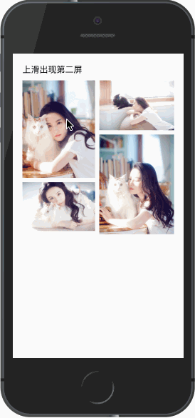

# 第二屏上拉展示

## 示例效果
<div style="margin-top: 30px">
    <span style="display: inline-block;vertical-align:middle">
        
    </span>
    <span style="display: inline-block;vertical-align:middle; margin-left: 100px;">
        
    </span>
</div>

## 介绍
- 通过配置`slot`为`secondScreen` 的模板来配置上拉出现的第二屏
- 可以通过配置`data`中的`hideInfo`与`hideToolbar`隐藏页码和图片信息
- 配置`onSecondScreenShow`与`onSecondScreenHide`回调函数来绑定出现第二屏的回调函数


## 代码

### 模板
```html {38-73}
<template>
    <div class="example-container">
        <h1>上滑出现第二屏</h1>
        <div class="img-container">
            <div class="img-left">
                <div class="img-wrapper" @click="onImgClick(0)">
                    
                </div>
                <div class="img-wrapper" @click="onImgClick(1)">
                    
                </div>
            </div>
            <div class="img-right">
                <div class="img-wrapper" @click="onImgClick(2)">
                    
                </div>
                <div class="img-wrapper c-gap-top" @click="onImgClick(3)">
                    
                </div>
            </div>
        </div>
        <image-viewer
            v-if="showViewer"
            ref="viewer"
            :list="list"
            :startIndex="showIndex"
            :hideInfo="hideInfo"
            :hideToolbar="hideToolbar"
            @enterstart="beforeViewerEnter"
            @leavestart="beforeViewerLeave"
            @leave="onViewerLeave"
            @switch="onViewerSwitch"
            @secondscreenshow="onSecondScreenShow"
            @secondscreenhide="onSecondScreenHide"
        >

            <!-- 自定义第二屏 -->
            <template slot="secondScreen">
                <div class="card">
                    <div class="title">
                        <div class="source">大众网</div>
                    </div>
                    <p>刘亦菲为什么不拍“宫斗戏”？网友：她一出场就大结局了！</p>
                    <div class="desc">
                        有些网友说：刘亦菲拍不了‘宫斗戏’，因为她一出场就大结局了！确实，要是真有这样一位美得动人心神的嫔妃，皇帝眼里怎么还能看得上其他人呢？这根本就不用进行‘宫斗’了，胜负立见分晓啊！就像“延禧”中的顺嫔一出场，所有人都顿时感觉到了威胁，人家根本就不需要出手，就能秒杀其他嫔妃。
                    </div>
                </div>
                <div class="card">
                <p>相关图片</p>
                <div class="card-img">
                    <ul>
                        <li>
                            
                            <div class="img-desc">刘亦菲旗袍装扮</div>
                        </li>
                        <li>
                            
                            <div class="img-desc">刘亦菲旗袍装扮</div>
                        </li>
                    </ul>
                    <ul>
                        <li>
                            
                            <div class="img-desc">刘亦菲旗袍装扮</div>
                        </li>
                        <li>
                            
                            <div class="img-desc">刘亦菲旗袍装扮</div>
                        </li>
                    </ul>
                </div>
                </div>
            </template>
        </image-viewer>
    </div>
</template>
```

### 配置数据和回调函数

```javascript
import ImageViewer from 'mux-vue-image-viewer';

export default {
    components: {
        ImageViewer
    },
    data() {
        return {
            list: [
                {
                    src: "http://img2.dzwww.com:8888/tupian/20171228/201712280839d2fccd9ec74f82.jpg",
                    width: 900,
                    height: 1200,
                    desc: "刘亦菲，1987年8月25日出生于湖北省武汉市，华语影视女演员、歌手，毕业于北京电影学院2002级表演系本科班。2002年主演个人首部电视剧《金粉世家》，从而踏入演艺圈。2003年因主演武侠剧《天龙八部》崭露头角。2004年凭借仙侠剧《仙剑奇侠传》赵灵儿一角获得了高人气与关注度。2005年因在金庸剧《神雕侠侣》中饰演小龙女受到广泛关注。2006年发行首张音乐专辑《刘亦菲》；"
                },
                {
                    src: "http://img2.dzwww.com:8888/tupian/20171228/201712280839914971c8162fe0.jpg",
                    width: 900,
                    height: 600,
                    desc: "2004年凭借仙侠剧《仙剑奇侠传》赵灵儿一角获得了高人气与关注度。2005年因在金庸剧《神雕侠侣》中饰演小龙女受到广泛关注。2006年发行首张音乐专辑《刘亦菲》；"
                },
                {
                    src: "http://img2.dzwww.com:8888/tupian/20171228/201712280839dfde29eeecef12.jpg",
                    width: 900,
                    height: 600,
                    desc: "2005年因在金庸剧《神雕侠侣》中饰演小龙女受到广泛关注。2006年发行首张音乐专辑《刘亦菲》；"
                },
                {
                    src: "http://img2.dzwww.com:8888/tupian/20171228/2017122808392ad32000858cb9.jpg",
                    width: 900,
                    height: 1200,
                    desc: "2008年起转战影坛，并凭借好莱坞电影《功夫之王》成为首位荣登IMDB电影新人排行榜榜首的亚洲女星 [9-10]  。2009年在“80后新生代娱乐大明星”评选活动中获封“四小花旦”之一 [11]  。"
                }
            ],
            showIndex: 0,
            showViewer: false
        }
    },
    methods: {
        onImgClick(i) {
            this.showViewer = true;
            this.showIndex = i;
        },
        beforeViewerEnter(obj, animate) {
            if (typeof animate === 'function') {
                let startEl = document.querySelectorAll('.img-wrapper')[obj.index];
                animate(startEl);
            }
        },
        beforeViewerLeave(obj, animate) {
            if (typeof animate === 'function') {
                let endEl = document.querySelectorAll('.img-wrapper')[obj.index];
                if (endEl) {
                    animate(endEl.getBoundingClientRect());

                    // 下面方式也可
                    animate(endEl);
                }
            }
        },
        onViewerLeave(data) {
            this.showViewer = false;
        },
        onViewerSwitch(obj) {
        }
    }
}
```

### 样式
``` stylus
.example-container
    padding 10px

    h1
        font-size 16px
        margin-bottom 10px

.img-container
    display flex

    .img-wrapper
        margin-bottom 8px

    .img-left
        width 49%
        margin-right 8px

    .img-right
        flex 1

.img-wrapper
    img
        display block
        width 100%

.card
    padding 16px 16px 0
    background-color #fff

.card-img
    display flex
    justify-content space-between

    ul
        margin-top 10px
        width 48%

    li
        margin-bottom 10px

        img
            width 100%

        .img-desc
            color #999
            font-size 12px
            margin 3px 0 10px
.title
    margin-bottom 10px

.source
    line-height 30px
    border 1px solid #ddd
    display inline
    height 30px
    padding 5px 10px
    border-radius 20px

p
    line-height 20px
    font-weight 700
    margin 3px 0 5px

.desc
    color #777
    font-size 13px
    line-height 18px
```
