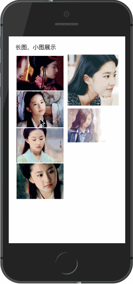

# 长图模式

## 示例效果
<div style="margin-top: 30px">
    <span style="display: inline-block;vertical-align:middle">
        
    </span>
    <span style="display: inline-block;vertical-align:middle; margin-left: 100px;">
        
    </span>
</div>

## 介绍
- 通过设置`data`中`list`字段的`width` 和`height` 为实际图片宽高，图片展开后会默认

## 代码

### 模板
```html
<template>
    <div class="example-container">
        <h1>长图，小图展示</h1>
        <div class="img-container">
            <div class="img-left">
                <div class="img-wrapper" @click="onImgClick(0)">
                    
                </div>
            </div>
            <div class="img-right">
                <div class="img-wrapper" @click="onImgClick(1)">
                    
                </div>
                <div class="img-wrapper c-gap-top" @click="onImgClick(2)">
                    
                </div>
            </div>
        </div>
        <image-viewer
            v-if="showViewer"
            ref="viewer"
            :list="list"
            :startIndex="showIndex"
            @enterstart="beforeViewerEnter"
            @leavestart="beforeViewerLeave"
            @leave="onViewerLeave"
            @switch="onViewerSwitch"
        >
            <template slot="toolbar">
                <p style="position: relative; width: 100%; text-align: center; line-height: .42rem;">自定义工具栏</p>
            </template>
        </image-viewer>
    </div>
</template>
```

### 配置数据和回调函数

```javascript
import ImageViewer from 'mux-vue-image-viewer';

export default {
    components: {
        ImageViewer
    },
    data() {
        return {
            list: [
                {
                    src: "https://ss2.bdstatic.com/70cFvnSh_Q1YnxGkpoWK1HF6hhy/it/u=209782273,3126058885&fm=26&gp=0.jpg",
                    width: 588,
                    height: 1724,
                    desc: "刘亦菲，1987年8月25日出生于湖北省武汉市，华语影视女演员、歌手，毕业于北京电影学院2002级表演系本科班。2002年主演个人首部电视剧《金粉世家》，从而踏入演艺圈。2003年因主演武侠剧《天龙八部》崭露头角。2004年凭借仙侠剧《仙剑奇侠传》赵灵儿一角获得了高人气与关注度。2005年因在金庸剧《神雕侠侣》中饰演小龙女受到广泛关注。2006年发行首张音乐专辑《刘亦菲》；"
                },
                {
                    src: "https://ss1.bdstatic.com/70cFvXSh_Q1YnxGkpoWK1HF6hhy/it/u=4233215679,1799580266&fm=26&gp=0.jpg",
                    width: 120,
                    height: 120,
                    desc: "2004年凭借仙侠剧《仙剑奇侠传》赵灵儿一角获得了高人气与关注度。"
                },
                {
                    src: "https://timgsa.baidu.com/timg?image&quality=80&size=b9999_10000&sec=1540895411180&di=169c25cb8e6fc003630619163d73c96f&imgtype=0&src=http%3A%2F%2Fb-ssl.duitang.com%2Fuploads%2Fitem%2F201408%2F30%2F20140830170758_Ed8yF.jpeg",
                    width: 585,
                    height: 390,
                    desc: "2004年凭借仙侠剧《仙剑奇侠传》赵灵儿一角获得了高人气与关注度。2005年因在金庸剧《神雕侠侣》中饰演小龙女受到广泛关注。2006年发行首张音乐专辑《刘亦菲》；"
                },
                {
                    src: "https://timgsa.baidu.com/timg?image&quality=80&imgtype=0&size=b10000_10000&sec=1533644795&di=8012e779d87b3c85bc06538bf7d1711f&src=http%3A%2F%2Ftupian.enterdesk.com%2F2014%2Fmxy%2F09%2F12%2F2%2F1.jpg",
                    width: 1920,
                    height: 1200,
                    desc: "2004年凭借仙侠剧《仙剑奇侠传》赵灵儿一角获得了高人气与关注度。"
                }
            ],
            showIndex: 0,
            showViewer: false
        }
    },
    methods: {
        onImgClick(i) {
            this.showViewer = true;
            this.showIndex = i;
        },
        beforeViewerEnter(obj, animate) {
            if (typeof animate === 'function') {
                let startEl = document.querySelectorAll('.img-wrapper')[obj.index];
                animate(startEl);
            }
        },
        beforeViewerLeave(obj, animate) {
            if (typeof animate === 'function') {
                let endEl = document.querySelectorAll('.img-wrapper')[obj.index];
                if (endEl) {
                    animate(endEl.getBoundingClientRect());

                    // 下面方式也可
                    animate(endEl);
                }
            }
        },
        onViewerLeave(data) {
            this.showViewer = false;
        },
        onViewerSwitch(obj) {
        }
    }
}
```

### 样式
``` stylus
.example-container
    padding 10px

    h1
        font-size 16px
        margin-bottom 10px

.img-container
    display flex

    .img-wrapper
        margin-bottom 8px

    .img-left
        width 49%
        margin-right 8px

    .img-right
        flex 1

.img-wrapper
    img
        display block
        width 100%
```
