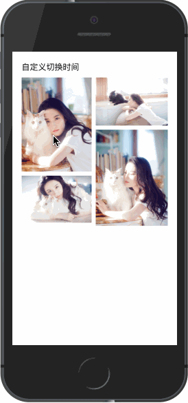

# 自定义图片切换时间

## 示例效果
<div style="margin-top: 30px">
    <span style="display: inline-block;vertical-align:middle">
        
    </span>
    <span style="display: inline-block;vertical-align:middle; margin-left: 100px;">
        
    </span>
</div>

## 介绍
- 可以通过设置`easySwipe`为`true`，实现滑动部分即可滑动页面不回弹；
- 通过设置`swipeDuration`，修改滑动动画时间, 单位为毫秒

## 代码

### 模板
```html
<template>
    <div class="example-container">
        <h1>自定义切换时间</h1>
        <div class="img-container">
            <div class="img-left">
                <div class="img-wrapper" @click="onImgClick(0)">
                    
                </div>
                <div class="img-wrapper" @click="onImgClick(1)">
                    
                </div>
            </div>
            <div class="img-right">
                <div class="img-wrapper" @click="onImgClick(2)">
                    
                </div>
                <div class="img-wrapper c-gap-top" @click="onImgClick(3)">
                    
                </div>
            </div>
        </div>
        <image-viewer
            v-if="showViewer"
            :list="list"
            :startIndex="showIndex"
            :isSwipeFirstLeave="false"
            :easySwipe="easySwipe"
            @enterstart="beforeViewerEnter"
            @leavestart="beforeViewerLeave"
            @leave="onViewerLeave"
            @switch="onViewerSwitch"
        >
            <template slot="toolbar">
                <p style="position: relative; width: 100%; text-align: center; line-height: .42rem;">自定义工具栏</p>
            </template>

        </image-viewer>
    </div>
</template>
```

### 配置数据和回调函数

```javascript {37-38}
import ImageViewer from 'mux-vue-image-viewer';

export default {
    components: {
        ImageViewer
    },
    data() {
        return {
            list: [
                {
                    src: "http://img2.dzwww.com:8888/tupian/20171228/201712280839d2fccd9ec74f82.jpg",
                    width: 900,
                    height: 1200,
                    desc: "刘亦菲，1987年8月25日出生于湖北省武汉市，华语影视女演员、歌手，毕业于北京电影学院2002级表演系本科班。2002年主演个人首部电视剧《金粉世家》，从而踏入演艺圈。2003年因主演武侠剧《天龙八部》崭露头角。2004年凭借仙侠剧《仙剑奇侠传》赵灵儿一角获得了高人气与关注度。2005年因在金庸剧《神雕侠侣》中饰演小龙女受到广泛关注。2006年发行首张音乐专辑《刘亦菲》；"
                },
                {
                    src: "http://img2.dzwww.com:8888/tupian/20171228/201712280839914971c8162fe0.jpg",
                    width: 900,
                    height: 600,
                    desc: "2004年凭借仙侠剧《仙剑奇侠传》赵灵儿一角获得了高人气与关注度。2005年因在金庸剧《神雕侠侣》中饰演小龙女受到广泛关注。2006年发行首张音乐专辑《刘亦菲》；"
                },
                {
                    src: "http://img2.dzwww.com:8888/tupian/20171228/201712280839dfde29eeecef12.jpg",
                    width: 900,
                    height: 600,
                    desc: "2005年因在金庸剧《神雕侠侣》中饰演小龙女受到广泛关注。2006年发行首张音乐专辑《刘亦菲》；"
                },
                {
                    src: "http://img2.dzwww.com:8888/tupian/20171228/2017122808392ad32000858cb9.jpg",
                    width: 900,
                    height: 1200,
                    desc: "2008年起转战影坛，并凭借好莱坞电影《功夫之王》成为首位荣登IMDB电影新人排行榜榜首的亚洲女星 [9-10]  。2009年在“80后新生代娱乐大明星”评选活动中获封“四小花旦”之一 [11]  。"
                }
            ],
            showIndex: 0,
            showViewer: false,
            swipeDuration: 200,
            easySwipe: false
        }
    },
    methods: {
        onImgClick(i) {
            this.showViewer = true;
            this.showIndex = i;
        },
        beforeViewerEnter(obj, animate) {
            if (typeof animate === 'function') {
                let startEl = document.querySelectorAll('.img-wrapper')[obj.index];
                animate(startEl);
            }
        },
        beforeViewerLeave(obj, animate) {
            if (typeof animate === 'function') {
                let endEl = document.querySelectorAll('.img-wrapper')[obj.index];
                if (endEl) {
                    animate(endEl.getBoundingClientRect());

                    // 下面方式也可
                    animate(endEl);
                }
            }
        },
        onViewerLeave(data) {
            this.showViewer = false;
        },
        onViewerSwitch(obj) {
            // 翻页逻辑
        }
    }
}
</script>
```

### 样式
``` stylus
.example-container
    padding 10px

    h1
        font-size 16px
        margin-bottom 10px

.img-container
    display flex

    .img-wrapper
        margin-bottom 8px

    .img-left
        width 49%
        margin-right 8px

    .img-right
        flex 1

.img-wrapper
    img
        display block
        width 100%
```
